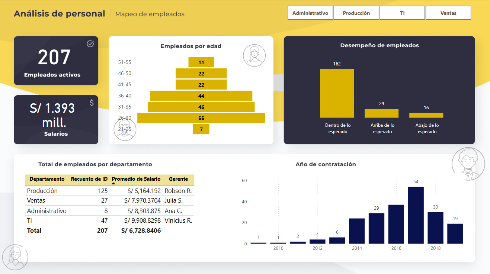

# 📊 Dashboard de Análisis de Personal

## 🚀 Descripción
Este proyecto es un **Dashboard de Análisis de Personal** diseñado para visualizar datos clave sobre la gestión de empleados en una organización. Permite realizar un seguimiento de métricas esenciales como el número de empleados activos, distribución por edad, desempeño laboral y distribución salarial.

## 🎯 Funcionalidades
- 📌 **Visualización interactiva** de datos de empleados.
- 📊 **Distribución por edad y desempeño laboral** en gráficos dinámicos.
- 🏢 **Segmentación por departamentos**, mostrando salarios promedio y gerentes asignados.
- 📈 **Tendencia de contratación** a lo largo de los años.
